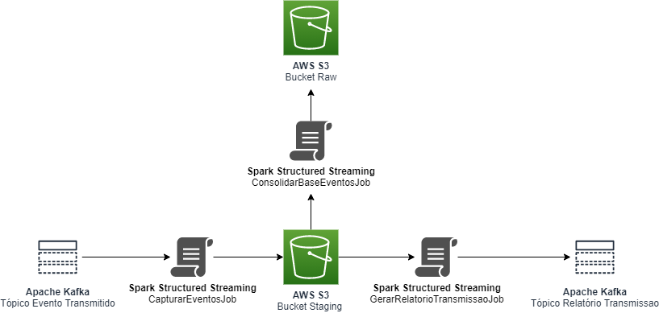
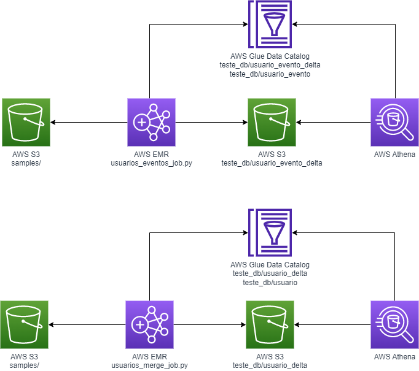

# Spark Structured Streaming Python Examples

## Apache Kafka
Examples of consumption and production of events in Kafka with Schema Registry, using Spark Structured Streaming.

## e-Financeira Transmission Monitoring Tool

### What is it?
e-Financeira is a accessory obligation that banks in Brazil have to report to Receita Federal do Brasil, the Brazilian federal revenue service.

### What we need to do?
Users need two things:

1. View events that were transmitted to RFB with success or error, in detail.
2. View a aggregated report with the sum of events categorized by success or error by company.

### Architecture
This example demonstrates how to use Kafka as a source to simultaneously populate a data lake and generate a aggregated report in near real time.



capturar_eventos_job.py: Consumes events and stores them in parquet format in a Source of Record bucket. Because it is a streamig consumption, a parquet file will be generated for each consumer/partition and micro batch.

consolidar_base_eventos_job.py: It consumes the files in the Source of Record bucket, consolidates them in a way that makes the most sense to optimize the queries and stores the result in a Source of Truth bucket.

gerar_relatorio_transmissao_job.py: It consumes the files in the Source of Record bucket, aggregates them as needed by the report and performs the posting to kafka.

### Requirements
```
pip install -r requirements.txt 
```

### Starting
```
<path_spark>\bin\spark-submit --packages org.apache.spark:spark-core_2.12:3.1.1,org.apache.spark:spark-sql_2.12:3.1.1,org.apache.spark:spark-sql-kafka-0-10_2.12:3.1.1,org.apache.spark:spark-avro_2.12:3.1.1 <path_script>\capturar_eventos_job.py
<path_spark>\bin\spark-submit --packages org.apache.spark:spark-core_2.12:3.1.1,org.apache.spark:spark-sql_2.12:3.1.1,org.apache.spark:spark-sql-kafka-0-10_2.12:3.1.1,org.apache.spark:spark-avro_2.12:3.1.1 <path_script>\consolidar_base_eventos_job.py
<path_spark>\bin\spark-submit --packages org.apache.spark:spark-core_2.12:3.1.1,org.apache.spark:spark-sql_2.12:3.1.1,org.apache.spark:spark-sql-kafka-0-10_2.12:3.1.1,org.apache.spark:spark-avro_2.12:3.1.1 <path_script>\gerar_relatorio_transmissao_job.py
```

## Delta Lake
Examples of data consumption and production in Delta Lake, using Spark Structured Streaming.



### Scripts

usuario_evento_job.py: Consumes events stored as parquet files in a samples bucket and saves them in a delta table as a event, appending only.

usuario_merge_job.py: Consumes events stored as parquet files in a samples bucket and merges them in a delta table.

Both scripts first registers the delta tables in the catalog, generate those tables manifest files and create a virtual table in the catalog from the manifest files so it can be queryable by tools like Athena, Presto and Trino.

The use of the trigger(once=True) feature is important as a cost saving if you don't need near real time Analytics.

### Requirements
```
pip install -r requirements.txt 
```

### Starting
```
<path_spark>\bin\spark-submit --packages io.delta:delta-core_2.12:2.1.1 <path_script>\capturar_eventos_job.py
<path_spark>\bin\spark-submit --packages io.delta:delta-core_2.12:2.1.1 <path_script>\consolidar_base_eventos_job.py
<path_spark>\bin\spark-submit --packages io.delta:delta-core_2.12:2.1.1 <path_script>\gerar_relatorio_transmissao_job.py
```